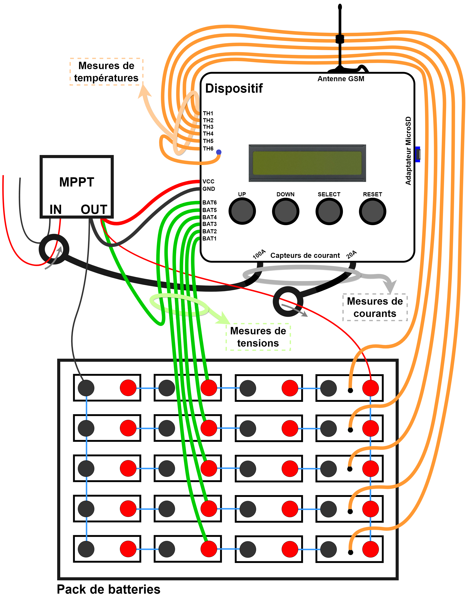
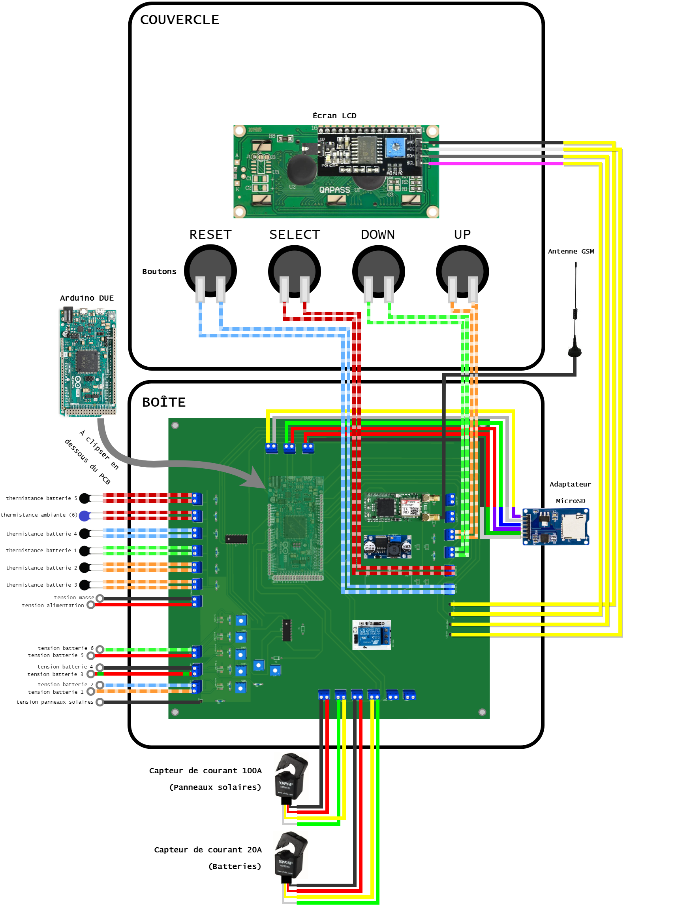

# Mobateli
<h1> Introduction </h1>

 
  Ce document présente le dispositif conçu à Kinshasa par des étudiants de <a href="https://polytech.ulb.be/">l'école polytechnique de Bruxelles</a> en  collaboration avec la <a href="https://www.cameskin.org/" target="_blank">CAMESKIN</a> dans le cadre du projet <a href="https://polytech.ulb.be/fr/international/cellule-de-cooperation-au-developpement" target="_blank">CODEPO</a> 2021-2022. 

 Celui-ci vise à améliorer l’utilisation de systèmes de batteries, par la conception d’un appareil de monitoring de l’énergie. Il s’agit d’un projet pilote qui pourra être généralisé à des systèmes électriques situés en milieu rural où l’accès à un dépannage serait long, difficile voire coûteux.

Le projet consiste à développer un dispositif permettant de monitorer un pack de batteries, ainsi qu'un exécutable pouvant être lancé sur un ordinateur afin de pouvoir visualiser les informations récoltées par le dispositif à distance.  
Le pourcentage restant des batteries est estimé en utilisant le filtre de Kalman développé dans <a href="https://www.researchgate.net/publication/332685740_Adaptive_Dual_Extended_Kalman_Filter_Based_on_Variational_Bayesian_Approximation_for_Joint_Estimation_of_Lithium-Ion_Battery_State_of_Charge_and_Model_Parameters"> l'article suivant </a>. Pour ce faire, le pack de batteries est modélisé par un circuit équivalent, dont les paramètres sont estimés à l'aide d'un test <a href="https://www.researchgate.net/figure/Hybrid-Pulse-Power-Characterization-HPPC-test-profile_fig2_235602059">HPPC</a>, et de scripts MATLAB disponibles sur ce git.  
Des scripts python permettent également de monitorer les panneaux solaires connectés au pack de batteries, en comparant la puissance délivrée (mesurée par le dispositif) à la puissance théorique calculée à partir des données météorologiues locales.  
Le microcontrôleur utilisé dans le cadre de ce dispositif est une carte Arduino DUE mais rien n'exclut l'adaption du code sur d'autres microcontrôleurs.

  
<h1> Aperçu général </h1>

<h2> Extérieur du dispositif </h2>
Le dispositif permet de monitorer un pack de batteries relié à des panneaux solaires. Pour ce faire, il possède les éléments suivantes :
<ul>
  <li> <b>7 entrées de mesures de tensions</b>   
    &#x2192; cela permet de monitorer jusqu'à 6 sous-packs de batteries + 1 entrée pour mesurer la tension aux bornes des panneaux solaires.  </li>
  <li> <b>2 capteurs de courant </b>  
    &#x2192; cela permet de mesurer le courant entrant dans l'ensemble du battery pack et le courant sortant des panneaux solaires. </li>
  <li> <b>6 capteurs de températures </b>  
    &#x2192; cela permet de mesurer les températures de chacun des sous-packs de batteries (<i>Th1</i> à <i>Th6</i>).
  </li>
  <li> <b>Une entrée d'alimentation</b>  
    &#x2192; cela permet d'alimenter le dispositif avec une tension d'entrée de 5V à 50V (<i>Vcc</i> et <i>Gnd</i>). 
  </li>
  <li> <b>Une antenne</b>  
    &#x2192; cela permet d'envoyer des alertes en cas de dysfonctionnement des batteries ou des panneaux solaires. Lorsque le dispositif détecte le  
    problème, il envoie un message MQTT à un Broker Thingstream. Ce dernier envoie ensuite un mail aux personnes de référence <i>(voir la section   
    "Thingstream" pour savoir en quoi consiste le broker thingstream et comment définir les personnes de référence).</i>  
    &#x2192; cela permet également d'envoyer des bilans journaliers correspondant aux données récoltées par le dispositif au cours de la journée.
    Celles-ci sont envoyées chaque jour à un Broker Thingstream qui les stocke en attendant leur récupération via des exécutables 
    <i>(voir la section "Codes Python")</i>.
  </li> 
  <li> <b>Un lecteur micro SD</b>  
    &#x2192; cela permet de récolter des données plus précises via le dispositif et de les enregistrer sur la carte micro SD. 
  </li>
  <li> <b>Un écran LCD et 4 boutons</b>  
    &#x2192; cela permet de faciliter l'expérience utilisateur et de pouvoir visualiser les données mesurées par le dispositif en temps réel. 
  </li>
</ul>
 

<h2> Intérieur du dispositif </h2>
À l'intérieur du dispositif se trouve la carte imprimée (PCB) à laquelle plusieurs éléments y sont connectés :
<ul> 
  <li> Arduino DUE </li>
  <li> Écran LCD + boutons </li>
  <li> Résistances + diodes + condensateurs + diodes + thermistances + multiplexeurs + relay </li>
  <li> Capteurs de courant à effet Hall </li>
  <li> Thingstream click </li>
  <li> Régulateur de tension </li>
  <li> Lecteur de carte micro-SD </li>
</ul>

