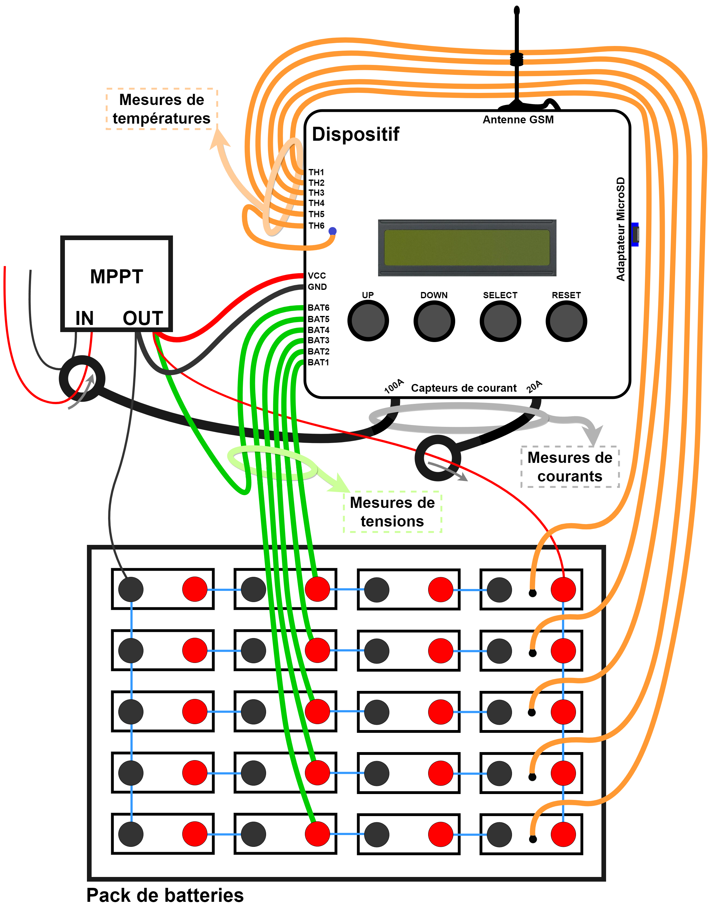

# Mobateli
<h1> Introduction </h1>

 Ce document présente le dispositif conçu à Kinshasa par des étudiant de <a href="https://polytech.ulb.be/">l'école polytechnique de Bruxelles</a> en collaboration avec la <a href="https://www.cameskin.org/" target="_blank">CAMESKIN</a> dans le cadre du projet <a href="https://polytech.ulb.be/fr/international/cellule-de-cooperation-au-developpement" target="_blank">CODEPO</a> 2021-2022. 

 Celui-ci vise à améliorer l’utilisation de systèmes de batteries, par la conception d’un appareil de monitoring de l’énergie. Il s’agit d’un projet pilote qui pourra être généralisé à des systèmes électriques situés en milieu rural où l’accès à un dépannage serait long, difficile voire coûteux.

<h1> Aperçu général </h1>

Le dispositif permet de monitorer un pack de batterie relié à des panneaux solaires. Pour ce faire, il possède les caractéristiques suivantes :
<ul>
  <li> <b style='color:red;'>7 entrées de mesures de tensions</b>   
    &#x2192; cela permet de monitorer jusqu'à 6 sous-packs de batteries (<i>Bat1</i> à <i>Bat6</i>) en mesurant leurs tensions respectives + 1 entrée pour mesurer la tension aux bornes des panneaux solaires.  </li>
  <li> <b>2 capteurs de courant </b>  
    &#x2192; cela permet de mesurer d'une part le courant entrant dans l'ensemble du battery pack, et d'autre part le courant sortant des panneaux solaires. </li>
  <li> <b>6 capteurs de températures </b>  
    &#x2192; cela permet de mesurer les températures de chacun des sous-packs de batteries (<i>Th1</i> à <i>Tht6</i>).
  </li>
  <li> <b>Une entrée d'alimentation</b>  
    &#x2192; cela permet d'alimenter le dispositif avec une tension d'entrée de maximum 50 volt et minimum 5 volt (<i>Vcc</i> et <i>Gnd</i>). 
  </li>
  <li> <b>Une antenne</b>  
    &#x2192; cela permet d'envoyer des alertes en cas de dysfonctionnement des batteries ou des panneaux solaires. Lorsque le dispositif détecte le  
    problème, il envoie un message MQTT à un Broker Thingstream. Ce dernier envoie ensuite un mail aux personnes de référence <i>(voir la section   
    "Thingstream" pour savoir en quoi consiste le broker thingstream et comment définir les personnes de référence).</i>  
    &#x2192; cela permet également d'envoyer des bilans journaliers correspondant aux données récoltées par le dispositif au cours de la journée.
    Celles-ci sont envoyées chaque jour à un Broker Thingstream qui les stocke en attendant que quelqu'un les récupère via les codes Python 
    <i>(voir la section "Codes Python")</i>.
  </li> 
  <li> <b>Un lecteur micro SD</b>  
    &#x2192; cela permet de récolter des données plus précises via le dispositif et de les enregistrer sur la carte micro SD. 
  </li>
  <li> <b>Un écran LCD et 4 boutons</b>  
    &#x2192; cela permet de faciliter l'expérience utilisateur et de pouvoir visualiser les donées mesurées par le dispositif en temps réel. 
  </li>
</ul>
